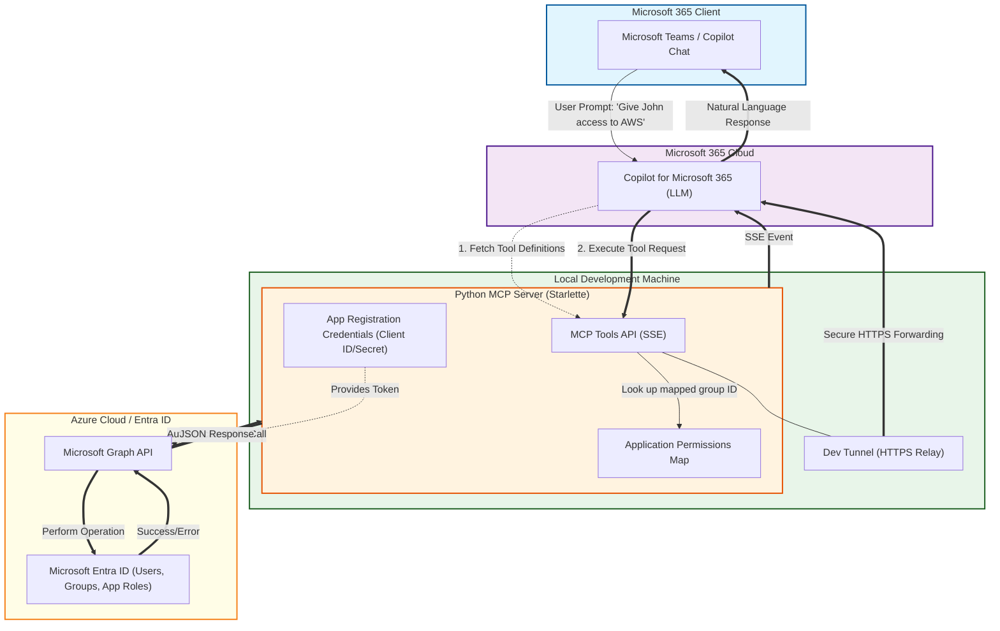

# Entra ID Management - MCP & Copilot Agent

This project provides a **Declarative Copilot Agent** powered by a **Python MCP (Model Context Protocol) Server**. It allows administrators to manage Entra ID users and group-based application access using natural language through Microsoft Copilot. The intended audience is help desk staff who provide level 1 support but need to escalate some things to other engineering staff. This Entra CoPilot agent will empower them to use natural language to do tasks such as granting access to an application or adding user to a group. I have only implemented some samples however the idea is that you will be able to manage everyting through this CoPilot agent without needing to logon to Entra portal, escalate your privileges or go through jumpboxes etc. This solves a very real problem that is present in enterprises and should make life easy for some staff.

> [!CAUTION]
> ### 🛑 Hobby Project - Not Production Grade
> **This is an educational project only.** It does not contain authentication or production-hardened security.
> 
> The sole purpose is to demonstrate the capabilities made possible through **Copilot agents** and **MCP servers**. This is a "teaser" for performing real-world tasks through natural language—the possibilities are truly endless.

> [!IMPORTANT]
> ## 🎒 Prerequisites - What to Bring
> Before deploying, make sure you have the following ready:
> 
> | Requirement | Description |
> |-------------|-------------|
> | 🎫 **Microsoft 365 Copilot License** | You need an active Microsoft 365 Copilot license to test and deploy agents |
> | 🏢 **Tenant with Sideloading Enabled** | Access to a Microsoft 365 tenant where you can sideload custom apps for testing |


## 1. System Architecture

The solution uses a multi-layered approach to bridge the gap between LLM reasoning and secure identity management.


1.  **Copilot Agent:** The user interface (Teams/Microsoft 365) that interprets intent.
2.  **MCP Server (Python):** A Starlette-based server that exposes specific tools (User Lookup, Group Addition).
3.  **Dev Tunnel:** Provides a secure HTTPS relay from the public internet to your local machine.
4.  **Microsoft Graph API:** The engine that performs the actual changes in Entra ID.
5.  **Entra ID:** The identity provider containing your users and groups.



---

## 2. Configure Entra ID App Registration

The Python server requires an Identity to talk to the Graph API.

1.  Log in to the [Azure Portal](https://portal.azure.com) and navigate to **Microsoft Entra ID**.
2.  Go to **App registrations** > **New registration**.
    * **Name:** `Entra-MCP-Server`
    * **Supported account types:** Accounts in this organizational directory only.
3.  **Authentication:** No Redirect URI is needed for this service-to-service flow.
4.  **Certificates & Secrets:**
    * Go to **Client secrets** > **New client secret**.
    * **Copy the Value** immediately (you won't see it again).
5.  **API Permissions:**
    * Click **Add a permission** > **Microsoft Graph** > **Application permissions**.
    * Add: `User.Read.All`, `GroupMember.ReadWrite.All`, `Directory.Read.All`.
    * **Important:** Click **Grant admin consent for [Your Org]**.

---

## 3. Running the Python MCP Server

You can run the server using standard Python or the high-performance `uv` package manager.

### Option A: Using UV (Recommended)
```powershell
# Install dependencies
uv sync

# Run the server
uv run main.py
```

## 4 Local Testing with MCP Inspector
------------------------------------

Before connecting to Copilot, use the **MCP Inspector** to verify your tools are working correctly.

1.  PowerShell npm install -g @modelcontextprotocol/inspector
    
2.  PowerShell npx @modelcontextprotocol/inspector http://localhost:8000/mcp
    
3.  **Test the Tools:**
    
    *   In the browser window that opens, select the lookup\_user tool.
        
    *   Provide a test name (e.g., "Jane Doe").
        
    *   Verify you receive a JSON response with the User ID.
        

## 5 Connecting Copilot Agent to MCP
-----------------------------------

1.  PowerShelldevtunnel host -p 8000 --allow-anonymous_Copy the provided .devtunnels.ms URL._
    
2.  JSON"capabilities": \[ { "name": "mcp-server", "mcp\_endpoint": "\[https://YOUR-TUNNEL-ID.devtunnels.ms/mcp\](https://YOUR-TUNNEL-ID.devtunnels.ms/mcp)" }\]
    
3.  **Provision via M365 agetn Toolkit:**
    
    *   Open **VS Code**.
        
    *   Click the **M365 agent Toolkit** icon in the sidebar.
        
    *   Under **Lifecycle**, click **Provision**.
        
    *   Once finished, go to copilot chat and you'll see your agent on the side bar.
        
4.  **Chat with the Agent:** In Copilot agent, select your new agent and type: _"Find user Jane Smith and tell me what groups she is in."_